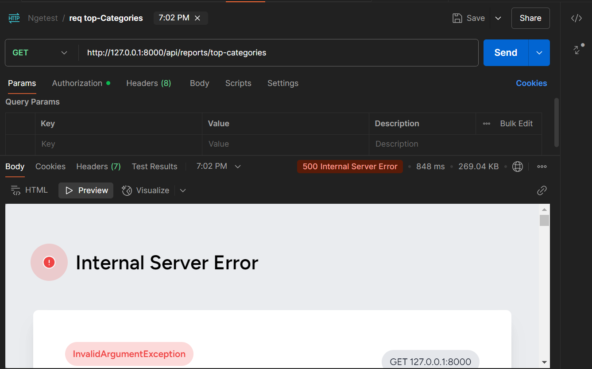
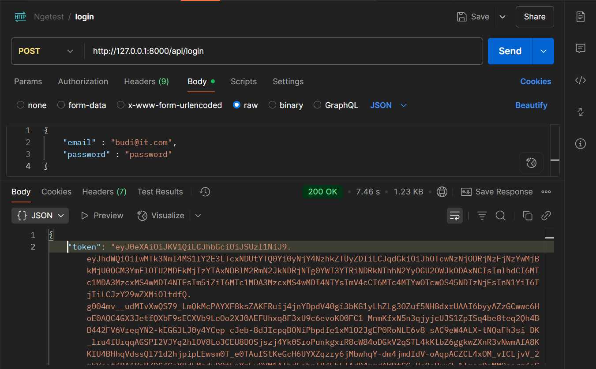
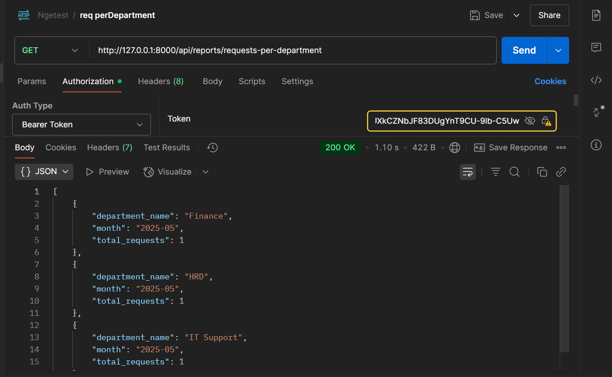
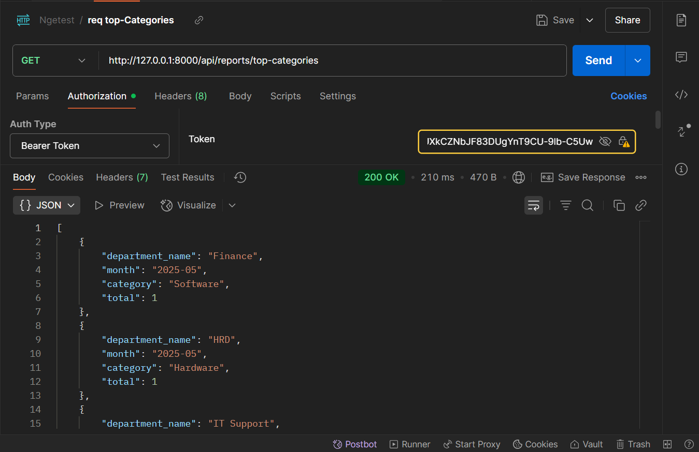

# Info Update fixing error kemarin
### Kendala
- Padahal API sudah bener tapi kenapa sek error?

```php
Route::middleware('auth:api')->group(function () {
    Route::get('/reports/requests-per-department', [ReportController::class, 'requestsPerDepartment']);
    Route::get('/reports/top-categories', [ReportController::class, 'topCategories']);
});
```
Padahal routing sudah bener tapi error waktu cek di postman malah Server Error dua" nya.



## Langkah Perbaikan
1. database.sqlite
    Hapus file `database/database.sqlite` -> jika data di dalamnya kosong atau error (di kasusku awalnya kosong atau jika migration error). Tujuan e biar migrasi dan seeder ga error nantinya.

2. migrations
    Karena dari awal sudah disediakan file di folder `migrations` dari DWP maka di terminal tinggal `php artisan migrate:fresh --seed` (tambahi `--force` jika error karena tahapan produksi).

3. Install Laravel Passport
    Ini sing kemarin belum ada, fungsi simplenya dia bikin autentikasi OAuth2 untuk API sehingga user bisa login via token. Di terminal jalankan `composer require lareavel:passport` kemudian jalankan `php artisan passport:install` (tambahi `--force` jika error produksi). Hasilnya nanti akan ada **5 file migrations tambahan**

4. Tambahan di `config/auth.php`
    Cek di `auth.php` ada tambahan code:
    ```php
    'guards' => [
        'web' => [
            'driver' => 'session',
            'provider' => 'users',
        ],
        // Ini tambahannya untuk api
        'api' => [
            'driver' => 'passport',
            'provider' => 'users',
            'hash' => false,
        ],
    ],
    ```

5. Update User Model

    ```php
    namespace App\Models;

    // use Illuminate\Contracts\Auth\MustVerifyEmail;
    use Illuminate\Database\Eloquent\Factories\HasFactory;
    use Illuminate\Foundation\Auth\User as Authenticatable;
    use Illuminate\Notifications\Notifiable;

    use Laravel\Passport\HasApiTokens; >>> Tambahan

    class User extends Authenticatable
    {
        /** @use HasFactory<\Database\Factories\UserFactory> */
        use HasFactory, Notifiable, HasApiTokens; >> Tambahan
    }
    ```

6. Kemudian dalam route.api ada tambahan
    Ini yang akan jadi request post untuk dapat tokennya
    ```php
    Route::post('/login', [\App\Http\Controllers\Auth\AuthController::class, 'login']);
    ```
    
    Token nanti di postman dimasukkan dalam `Bearer Token` biar api dengan middleware bisa diakses
    ```php
    Route::middleware('auth:api')->group(function () {
        Route::get('/reports/requests-per-department', [ReportController::class, 'requestsPerDepartment']);
        Route::get('/reports/top-categories', [ReportController::class, 'topCategories']);
    });
    ```

7. Controller untuk Login 
    Sudah ada api untuk mengatur login, sekarang untuk controllernya:
    ```php
    namespace App\Http\Controllers\Auth;

    use App\Http\Controllers\Controller;
    use Illuminate\Http\Request;
    use Illuminate\Support\Facades\Auth;

    class AuthController extends Controller
    {
        public function login(Request $request)
        {
            $credentials = $request->only('email', 'password');

            if (Auth::attempt($credentials)) {
                $user = Auth::user();
                $token = $user->createToken('API Token')->accessToken;
                return response()->json(['token' => $token], 200);
            }

            return response()->json(['error' => 'Unauthorized'], 401);
        }
    }

    ```

8. Last, update Controller di DB karena bukan menggunakan sintaks untuk database sqlite
    ```php
    class ReportController extends Controller
    {
        public function requestsPerDepartment()
        {
            $data = DB::select("
                SELECT
                    d.name as department_name,
                    strftime('%Y-%m', r.request_date) AS month,
                    COUNT(DISTINCT r.id) as total_requests
                FROM requests r
                JOIN users u ON r.user_id = u.id
                JOIN departments d ON u.department_id = d.id
                GROUP BY d.name, strftime('%Y-%m', r.request_date)
                ORDER BY month DESC
            ");

            return response()->json($data);
        }

        public function topCategories()
        {
            $data = DB::select("
                WITH ranked_categories AS (
                    SELECT
                        d.name AS department_name,
                        strftime('%Y-%m', r.request_date) AS month,
                        ri.category,
                        COUNT(*) AS total,
                        ROW_NUMBER() OVER (
                            PARTITION BY d.name, strftime('%Y-%m', r.request_date)
                            ORDER BY COUNT(*) DESC
                        ) AS rank
                    FROM requests r
                    JOIN users u ON r.user_id = u.id
                    JOIN departments d ON u.department_id = d.id
                    JOIN request_items ri ON r.id = ri.request_id  //>> wingi error karena pake requests_item, kudune requests_items
                    GROUP BY d.name, strftime('%Y-%m', r.request_date), ri.category
                )
                SELECT department_name, month, category, total
                FROM ranked_categories
                WHERE rank = 1
            ");

            return response()->json($data);
        }
    }
    ```

### Finally test di postman
1. Login
    
    **Dari login akan dapet token, token itu di copy dan paste ke Bearer Token waktu ingin akses ke API**
2. Test request Department
    
3. Test request Categories
    